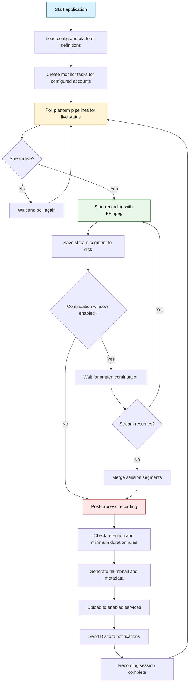

# Stream Recorder

A high-performance CLI tool written in Rust for recording live streams from a variety of platforms. It automatically monitors specified accounts or channels, records streams with FFmpeg, generates thumbnails, uploads content to multiple file hosting services, and sends notifications via Discord webhooks.

## Prerequisites

- Rust
- FFmpeg (must be installed and available in PATH)

## Installation

### From cargo

```bash
cargo install stream-recorder
```

### From Source

```bash
git clone https://github.com/sn0w12/stream-recorder-rs.git
cd stream-recorder-rs
cargo build --release
```

## Quick Start

For additional help, run:

```bash
stream-recorder -h
```

1. **Install a platform**

    To begin recording streams, you need to either install or create a platform json file. If you are looking to create your own, look into `/platforms/*` for examples.

    To install an already existing one, you can use the cli.

    ```bash
    stream-recorder platform install {url}
    ```

2. **Save a platform API token** (if required by the platform):

    Using keyring (recommended):

    ```bash
    stream-recorder token save-platform PLATFORM_ID YOUR_TOKEN_HERE
    ```

    Or define tokens in a `.env` file at `~/.config/stream-recorder/.env`:

    ```env
    PLATFORM_API_TOKEN=YOUR_TOKEN_HERE
    ```

    **Note:** If both keyring and .env file contain tokens, the keyring tokens will take precedence.

3. **Configure monitored accounts** (use `platform_id:username` format):

    ```bash
    stream-recorder config add monitors platform1:user1
    stream-recorder config add monitors platform2:user2
    ```

4. **Set output directory (optional):**

    ```bash
    stream-recorder config set output_directory ./my_recordings
    ```

5. **Start monitoring:**
    ```bash
    stream-recorder
    ```

The tool will run continuously, monitoring for live streams and recording them automatically.

## Stream Recording Flow

The diagram below shows the main phases of a recording session and how the major parts of the system interact.



## Configuration

Configuration is stored in `~/.config/stream-recorder/config.toml` (Linux/macOS) or `%APPDATA%\stream-recorder\config.toml` (Windows).

### Available Settings

| Setting                            | Description                                                                                          | Default        |
| ---------------------------------- | ---------------------------------------------------------------------------------------------------- | -------------- |
| `output_directory`                 | Directory to save recordings                                                                         | `./recordings` |
| `monitors`                         | List of usernames to monitor                                                                         | `none`         |
| `discord_webhook_url`              | Discord webhook URL for notifications                                                                | `none`         |
| `min_free_space_gb`                | Minimum free disk space before cleanup                                                               | `20`           |
| `upload_complete_message_template` | Template for upload completion messages                                                              | `none`         |
| `max_upload_retries`               | Maximum number of upload retries                                                                     | `3`            |
| `min_stream_duration`              | Minimum stream duration before recording                                                             | `none`         |
| `video_quality`                    | Quality target for variable bitrate video encoding (lower is better)                                 | `26`           |
| `stream_reconnect_delay_minutes`   | Delay in minutes to wait for stream continuation before post-processing. Streams resumed are merged. | `none`         |
| `disabled_uploaders`               | List of uploaders to skip uploading to                                                               | `none`         |
| `step_delay_seconds`               | Delay in seconds between each step in a platform                                                     | `0.5`          |
| `fetch_interval_seconds`           | The interval in seconds monitors are fetched at                                                      | `120`          |
| `thumbnail_size`                   | Size of each thumbnail in the grid, in WIDTHxHEIGHT format                                           | `320x180`      |
| `thumbnail_grid`                   | Grid layout for thumbnails, in COLSxROWS format                                                      | `3x3`          |

### Configuration Commands

```bash
# View all configuration
stream-recorder config get

# Get specific setting
stream-recorder config get output_directory

# Set a configuration value
stream-recorder config set output_directory /path/to/recordings

# Reset a configuration value to default
stream-recorder config reset output_directory

# Get config file path
stream-recorder config get-path

# Print the configuration table in README/markdown format
stream-recorder config md
```

## Features

### Discord Integration

Set up Discord notifications:

1. Create a webhook in your Discord server
2. Set the webhook channel to a **forum** channel. It will not work with a normal text channel.
3. Set the webhook URL:
    ```bash
    stream-recorder config set discord_webhook_url https://discord.com/api/webhooks/YOUR_WEBHOOK_ID/YOUR_WEBHOOK_TOKEN
    ```

The tool will send notifications when:

- Recording starts
- Recording completes
- Uploads complete _(using your template)_

Each monitor will create its own thread, keeping all streams organized.

### Template System

Templates are rendered using [Handlebars](https://handlebarsjs.com/), a powerful templating engine. You can use all standard Handlebars features: variables, conditionals, loops, and block helpers. See the [Handlebars documentation](https://handlebarsjs.com/guide/) for syntax and advanced usage.

#### Built-in Helpers

The following helpers are registered and available in all templates:

| Helper | Description                                                                                  |
| ------ | -------------------------------------------------------------------------------------------- |
| `add`  | Adds two numbers. <br>Usage: `{{add a b}}`                                                   |
| `gt`   | Returns true if first number is greater than second. <br>Usage: `{{#if (gt a b)}}...{{/if}}` |
| `ne`   | Returns true if two values are not equal. <br>Usage: `{{#if (ne a b)}}...{{/if}}`            |

For real-world usage, see the example template: [templates/example.hbr](templates/example.hbr)

#### Template Variables

The following variables are available in the template context:

| Variable              | Type   | Description                                          |
| --------------------- | ------ | ---------------------------------------------------- |
| `date`                | String | Current date (YYYY-MM-DD)                            |
| `username`            | String | Streamer's username                                  |
| `user_id`             | String | Streamer's user ID                                   |
| `output_path`         | String | Path to recorded video file                          |
| `thumbnail_path`      | String | Path to generated thumbnail                          |
| `stream_title`        | String | Title of the stream                                  |
| `<uploader>_urls`     | Array  | Array of an uploaders uploaded URLs                  |
| `<uploader>_urls_len` | Number | Length of any array variable (e.g. `bunkr_urls_len`) |

#### Testing Templates

Render a test message with mock data:

```bash
stream-recorder template render
```

### Upload Services

The tool supports uploading to multiple services. Tokens are stored securely and used automatically when available.

| Uploader  | Requires Token | Notes                                                                         |
| --------- | :------------: | ----------------------------------------------------------------------------- |
| Bunkr     |      Yes       | API token required; supports album/folder lookups.                            |
| GoFile    |      Yes       | API token supported; configurable server and folder ID.                       |
| Fileditch |       No       | Public file hosting uploader.                                                 |
| Filester  |       No       | Public file hosting uploader; supports album/folder lookups if token provided |

### File Organization

Recordings are organized as follows:

```
output_directory/
├── username1/
│   ├── username1_2025-01-01_12-00-00.mp4
│   ├── username1_2025-01-01_12-00-00_thumb.jpg
│   └── ...
└── username2/
    └── ...
```

### Disk Space Management

The tool automatically manages disk space by:

- Monitoring free space in the output directory
- Deleting oldest recordings when space falls below `min_free_space_gb`
- Removing associated thumbnail files

### License

This project is licensed under the MIT License - see the LICENSE file for details.
